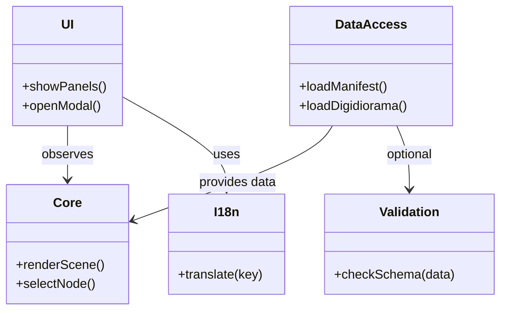

# digidiorama viewer 仕様書 v2（確定版）

## 0. 概要
digidiorama viewer は、JSON 形式で記述された「digidiorama データ」を Three.js を用いて可視化するビューアです。  
本仕様では **レイヤ分離** を基本方針とし、UI開発や拡張が Validation やその他付加機能に阻害されない構造を保証します。  

---

## 1. レイヤ構造

### 1.1 Core（必須）
- Three.js を利用してシーンを描画する中核部分  
- 機能:  
  - シーン生成、ノード・エッジの配置  
  - カメラ制御（回転・ズーム・パン）  
  - ノード選択・クリックなどの操作処理  
- **依存**: Three.js のみ  
- **原則**: Validation の成否に関係なく描画が可能  

---

### 1.2 UI（必須）
- PC 向けレイアウト  
  - 左：Layers パネル  
  - 中央：Viewer  
  - 右：Meta / Node / Errors パネル  
- モバイル向けレイアウト  
  - Viewer 全画面表示  
  - フローティングボタン＋モーダルUIで各パネルを表示  
- Core のイベントを受けて UI を更新  
- **依存**: Core, I18n  

---

### 1.3 DataAccess（必須）
- データロード機能を提供  
  - `manifest.json` から利用可能なファイル一覧を取得  
  - 選択された `.digidiorama.json` をロードし Core に渡す  
- **依存**: fetch API  
- **原則**: Validation が無効でもロードして Core に渡す  

---

### 1.4 Validation（オプション）
- JSON Schema に基づきデータを検証  
- DataAccess がロードしたデータに対して任意に実行  
- 結果は Errors パネルに表示  
- Core/UI の動作は停止させない  
- **依存**: Ajv などのスキーマ検証ライブラリ  
- **利用場面**: CI/CD・開発時・ユーザーが明示的にチェックした場合  

---

### 1.5 I18n（必須）
- 翻訳 JSON ファイルをロードし UI の文言を切替  
- UI のみに依存し Core には影響しない  
- **依存**: 翻訳ファイル（`ja.json`, `en.json` など）  

---

## 2. 依存関係図

---

## 3. 設計原則
1. **Core/UI は単独で動作可能**  
   - Validation に失敗しても描画は続行する  
2. **Validation はオプション依存**  
   - DataAccess のロード結果に対して任意で実行  
   - 結果は Errors パネルに通知  
3. **i18n は UI 専属**  
   - Core や DataAccess には関与しない  
4. **依存方向は一方通行**  
   - Core → UI の逆依存は持たない  
   - Validation は DataAccess にのみ関与  

---

## 4. 開発ステップ
- **P0**: Core + 最小UI（3D表示と操作）  
- **P1**: DataAccess（manifest/jsonロード）  
- **P2**: UI拡張（スマホ対応, i18n）  
- **P3**: Validation（オプション導入, CI連携）  
